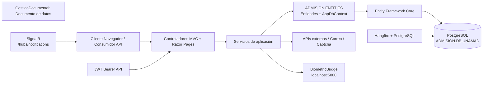
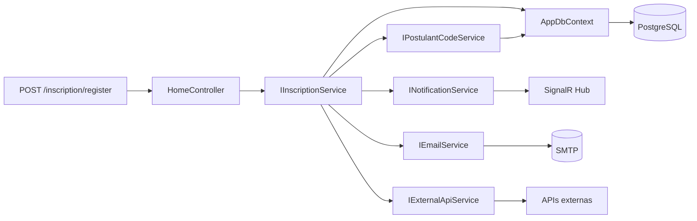
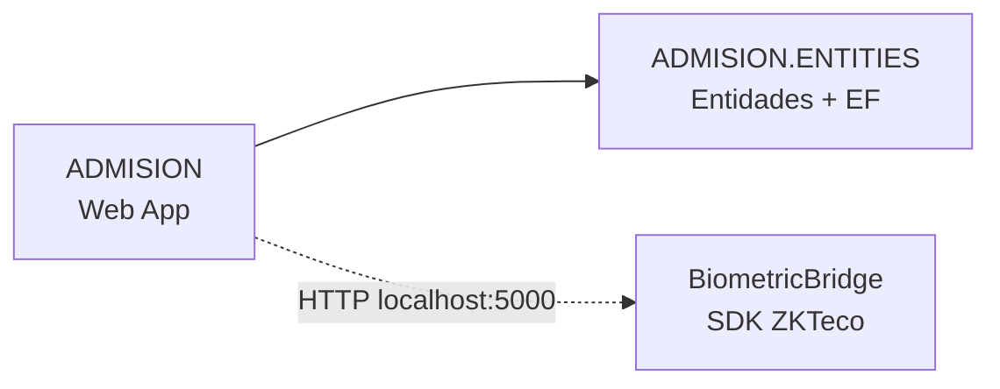
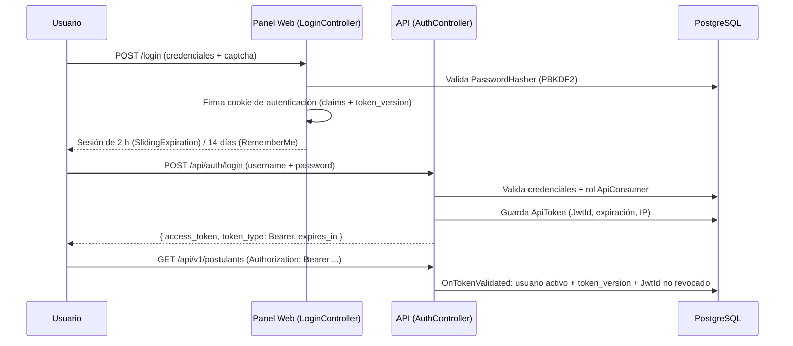
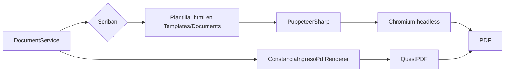

# 🏛️ Sistema de Inscripciones y Admisión (ADMISION) — UNAMAD

> Informe técnico generado automáticamente a partir del análisis completo del código fuente de la solución `ADMISION.slnx`.

| Campo | Valor |
|---|---|
| **Institución** | Universidad Nacional Amazónica de Madre de Dios (UNAMAD) |
| **Solución** | `ADMISION.slnx` |
| **Proyectos** | `ADMISION` (aplicación web) · `ADMISION.ENTITIES` (dominio/entidades) |
| **Framework** | .NET 10 (`net10.0`) |
| **Base de datos** | PostgreSQL (`ADMISION.DB.UNAMAD`) |
| **Frontend** | Razor Pages + MVC + Tailwind CSS |
| **Fecha del análisis** | 17 de agosto de 2026 |

---

## 📑 Tabla de contenido

- [Descripción](#descripción)
- [Características principales](#características-principales)
- [Tecnologías utilizadas](#tecnologías-utilizadas)
- [Arquitectura](#arquitectura)
- [Estructura de la solución](#estructura-de-la-solución)
- [Organización de carpetas](#organización-de-carpetas)
- [Requisitos](#requisitos)
- [Instalación](#instalación)
- [Configuración](#configuración)
- [Base de datos](#base-de-datos)
- [Dependencias NuGet](#dependencias-nuget)
- [Flujo de autenticación](#flujo-de-autenticación)
- [Flujo de autorización](#flujo-de-autorización)
- [APIs](#apis)
- [Servicios](#servicios)
- [Middleware](#middleware)
- [Integraciones](#integraciones)
- [Generación de PDFs](#generación-de-pdfs)
- [Logging](#logging)
- [Manejo de errores](#manejo-de-errores)
- [Seguridad](#seguridad)
- [Scripts útiles](#scripts-útiles)
- [Compilación](#compilación)
- [Publicación](#publicación)
- [Variables de entorno](#variables-de-entorno)
- [Convenciones del proyecto](#convenciones-del-proyecto)
- [Posibles mejoras](#posibles-mejoras)
- [Licencia](#licencia)

---

## 🎯 Descripción

**ADMISION** es un sistema web monolítico en capas que automatiza el proceso integral de admisión de la **Universidad Nacional Amazónica de Madre de Dios (UNAMAD)**. Permite a los postulantes realizar su **inscripción en línea** (carga de documentos, pago, verificación biométrica y consulta de resultados), y a la administración universitaria **gestionar todo el ciclo de admisión** desde un panel administrativo: modalidades de examen, carreras, vacantes, cronogramas, códigos de pago, importación de resultados (CEPRE y examen general), emisión de constancias y reportes.

### Problema que resuelve

- Elimina los trámites presenciales y en papel del proceso de admisión.
- Unifica en una sola plataforma: portal público, panel administrativo, API de consulta e integraciones biométricas y externas.
- Digitaliza la **emisión de constancias de inscripción e ingreso** (PDF con verificación por código QR).
- Automatiza la **importación masiva** de postulantes CEPRE, resultados de examen y consolidados de ingresantes.
- Controla el ciclo de vida del postulante: `Pendiente → Observado → Aprobado → Rechazado → Retirado`.

---

## ✨ Características principales

### Portal público
- Home institucional, misión, cronograma, carreras con detalle, modalidades, exámenes, vacantes, resultados y documentos por categoría.
- **Formulario de inscripción en línea** con carga de requisitos dinámicos según modalidad/tipo de postulante, comprobante de pago y captcha (Cloudflare Turnstile / Google reCAPTCHA).
- Cascada de **ubigeo** (departamento → provincia → distrito) y colegios por distrito.
- **Consulta de inscripción** por documento de identidad (DNI/CE/pasaporte) con captcha.
- **Constancia de inscripción/ingreso** en PDF descargable con código QR y **página pública de verificación** (`/verificar/{code}`).
- **Chatbot/FAQ** con matching semántico y opciones por menú.
- Respuesta JSON de configuración pública (`/public/config/list`).

### Panel administrativo
- **Dashboard** con KPIs, gráficos y filtros por término/modalidad/carrera/área temática.
- **Gestión de exámenes**: facultades, carreras, modalidades, tipos de modalidad, áreas temáticas, vacantes, tipos de postulante, requisitos, tipos de discapacidad, **perfiles de calificación** (con ponderación por rangos de preguntas).
- **Gestión económica**: códigos de pago (con monto por modalidad), métodos de pago.
- **Gestión de información**: banners, convocatorias, brochures, prospectos, reglamentos, temarios, patrocinadores, beneficiarios, FAQ, cronograma, publicaciones, archivos y **ubigeo con importación CSV**.
- **Gestión de infraestructura**: pabellones, aulas, horarios de examen y asignación de aulas.
- **Info postulante**: listado, ficha/resumen, asistencia (biometría), consolidado de ingresantes, emparejamiento CEPRE, **renuncias** y **anulaciones**.
- **Importaciones**: postulantes (Excel masivo vía Hangfire), resultados de admisión y CEPRE (con deshacer).
- **Usuarios, roles, docentes, colegios y períodos (términos)**.
- **Notificaciones en tiempo real** (SignalR) y **reportes** (Excel/PDF: asistencias, económicos, CEPRE, ingresantes, vacantes, áreas temáticas, general, SIRIES, sorteo de aulas, SUNEDU).
- **Configuración general** dinámica (datos de la institución, SMTP, colores, redes sociales), **APIs externas** registrables y **consultas de personas** (consulta académica y vouchers de pago vía APIs externas).
- **Importación de resultados de admisión** (Excel con plantilla, vista previa y deshacer).
- **Turnos de importación CEPRE** (asignación de ventanas de tiempo a usuarios de soporte).

### APIs e integraciones
- **API REST v1** (`/api/v1/postulants`) protegida con JWT Bearer para consumo de inscripciones y consolidado de ingresantes.
- Verificación biométrica de huella mediante el **puente local BiometricBridge** (SDK ZKTeco).
- Invocación de **APIs externas configuradas** (consulta académica, vouchers de pago) con plantillas, autenticación y auditoría.
- Envío de correos SMTP y captcha.

---

## 🛠️ Tecnologías utilizadas

| Tecnología | Versión | Uso |
|---|---|---|
| .NET / ASP.NET Core | 10.0 (`net10.0`) | Framework base de la aplicación web |
| C# | 13 | Lenguaje de programación |
| ASP.NET Core MVC | 10.0 | Controladores, vistas y model binding |
| Razor Pages | 10.0 | Portal público y páginas del panel admin |
| Entity Framework Core | 10.0.2 | ORM y migraciones de base de datos |
| Npgsql.EntityFrameworkCore.PostgreSQL | 10.0.0 | Proveedor EF Core para PostgreSQL |
| PostgreSQL | — | Motor de base de datos (`ADMISION.DB.UNAMAD`) |
| Hangfire | 1.8.23 | Tareas en segundo plano (importaciones, job recurrente) |
| Hangfire.PostgreSql | 1.21.1 | Almacenamiento de Hangfire en PostgreSQL |
| ClosedXML | 0.105.0 | Lectura/exportación de archivos Excel (importaciones y reportes) |
| QuestPDF | 2024.12.3 | Generación de PDF de constancia de ingreso |
| Scriban | 7.2.3 | Motor de plantillas HTML (documentos) |
| PuppeteerSharp | 20.0.5 | Renderizado HTML → PDF (navegador headless Chromium) |
| QRCoder | 1.6.0 | Generación de códigos QR para constancias |
| SixLabors.ImageSharp | 3.1.11 | Procesamiento de imágenes |
| Microsoft.AspNetCore.Authentication.JwtBearer | 10.0.9 | Autenticación JWT para la API |
| Tailwind CSS | ^3.4.17 | Framework CSS utilitario (design system) |
| @tailwindcss/cli | ^4.1.18 | Compilador CLI de Tailwind |
| SweetAlert2 | ^11.26.18 | Diálogos y notificaciones en el panel |
| FontAwesome | ^7.1.0 | Iconografía |
| Toastify-js | ^1.12.0 | Notificaciones toast |
| Tabler Icons | — | Iconografía adicional (vendorizada) |
| html5-qrcode | — | Escaneo de códigos QR en el navegador |
| Inter (fuente) | — | Tipografía del sistema |
| dotnet-ef (herramienta local) | 10.0.10 | CLI de migraciones EF Core |

---

## 🏗️ Arquitectura

El sistema es un **monolito en capas** con separación de responsabilidades: presentación (Controladores + Razor Pages), aplicación (Servicios) y datos (EF Core + PostgreSQL). El dominio vive en el proyecto `ADMISION.ENTITIES` y la aplicación web en `ADMISION`, que consume el primero por referencia de proyecto.

### Capas

| Capa | Proyecto | Responsabilidad |
|---|---|---|
| **Presentación** | `ADMISION` | Controladores MVC (`Controllers/`), Razor Pages (`Pages/`), ViewModels, estáticos (`wwwroot`) |
| **Aplicación** | `ADMISION` | Servicios de aplicación (`Services/Implementations`), interfaces (`Services/Interfaces`), jobs (`Services/Background`) |
| **Infraestructura** | `ADMISION` | Middleware, Hubs (SignalR), Hangfire, interceptor de auditoría |
| **Dominio / Datos** | `ADMISION.ENTITIES` | Entidades (`Models/`), `AppDbContext` (82 DbSet), constantes, migraciones |



### Flujo de datos general



---

## 📁 Estructura de la solución

### ADMISION.slnx
Solución que agrupa los dos proyectos de la aplicación web:

| Proyecto | Tipo | Descripción |
|---|---|---|
| **ADMISION** (`ADMISION/ADMISION.csproj`) | Aplicación web ASP.NET Core | Controladores, Razor Pages, servicios, middleware, hubs, plantillas y estáticos. Incluye el `Program.cs` con la composición completa del contenedor de dependencias, autenticación, autorización, rate limiting, Hangfire y SignalR. |
| **ADMISION.ENTITIES** (`ADMISION.ENTITIES/ADMISION.ENTITIES.csproj`) | Biblioteca de clases | Entidades de dominio, `AppDbContext` (82 `DbSet`), constantes de negocio, configuraciones dinámicas y **todas las migraciones EF Core**. |

### Solución complementaria (fuera de `ADMISION.slnx`)
| Proyecto | Descripción |
|---|---|
| **BiometricBridge** (`BiometricBridge/BiometricBridge.slnx`) | Micro-API local (minimal API, `win-x86`, self-contained) que sirve de puente con el SDK biométrico **ZKTeco** (`libzkfpcsharp`). Expone `/api/biometric/capture`, `/api/biometric/verify` y `/api/biometric/status` en `http://localhost:5000`. Se distribuye como instalador Inno Setup. |

### Referencias entre proyectos



---

## 📂 Organización de carpetas

### `ADMISION/`

| Carpeta | Contenido |
|---|---|
| `Controllers/` | 68 controladores MVC agrupados por área: `Admin/` (61), `Public/` (5) y `Api/` (2). |
| `Services/Interfaces/` | 73 contratos (`IAuthService`, `IInscriptionService`, `IDocumentService`, `IEmailService`, `ICaptchaService`, `IScoringProfileService`, reportes, catálogos, etc.). |
| `Services/Implementations/` | 78 implementaciones de servicios de aplicación, reportes y exportación. |
| `Services/Background/` | Jobs de Hangfire (`ModalityStatusJob`, `PostulantImportJob`). |
| `Services/Interceptors/` | `AuditInterceptor` (auditoría de cambios en EF Core). |
| `Models/ViewModels/` | 38 ViewModels agrupados por área: `Admin/` (18), `Public/` (6), `Api/` (1), `Reports/` (11), raíz (1). |
| `Models/Shared/` | Modelos compartidos. |
| `Data/` | `DbInitializer` (seed de roles, usuario admin, configuración, discapacidades, ubigeo, universidades). |
| `Extensions/` | Helpers: `ControllerErrorExtensions` (errores uniformes vía `TempData`), `HttpRequestExtensions` (`IsAjaxRequest`). |
| `Middleware/` | `ApiLoggingMiddleware` (auditoría de requests `/api/`). |
| `Hubs/` | `NotificationHub` (SignalR, grupo `admins`). |
| `Infrastructure/Hangfire/` | Filtro de autorización del dashboard (`HangfireDashboardAuthorizationFilter`). |
| `Pages/` | Razor Pages: `Public/` (15 páginas del portal), `Admin/` (100+ páginas del panel), `Shared/` (layouts, partials y componentes UI reutilizables). |
| `Templates/Documents/` | Plantillas HTML (`ConstanciaIngreso.html`, `ConstanciaInscripcion.html`) para renderizado de PDFs. |
| `wwwroot/` | Estáticos: `css/` (Tailwind `input.css`/`output.css`, `site.css`), `js/` (por módulos admin y público), `lib/` (librerías vendorizadas), `fonts/`, `img/`, `data/geo/`, `broshure/`. |
| `Properties/PublishProfiles/` | Perfil `FolderProfile.pubxml` (FileSystem → `C:\inetpub\wwwroot\Deploy.Admision`). |

### `ADMISION.ENTITIES/`

| Carpeta | Contenido |
|---|---|
| `Models/` | Entidades de dominio por subdominio: `Users` (5), `Postulant` (9), `Modality` (14), `Exam` (11), `Infrastructure` (5), `EconomicManagement` (4), `Info` (8), `Requirement` (3), `Schools` (1), `Ubigeo` (4), `System` (4), `Notifications` (2), `Integrations` (5), `Biometrics` (3), `Api` (2). |
| `Data/` | `AppDbContext` (82 `DbSet`, esquemas PostgreSQL por dominio, índice único `ModalityId + CodePostulant`, política de borrado `Restrict`). |
| `Constants/` | `AppConstants` (roles, estados, categorías, fases) y `ConfigGeneral` (claves de configuración dinámica). |
| `Migrations/` | 26 migraciones EF Core + snapshot del modelo. |

---

## ✅ Requisitos

| Requisito | Versión mínima | Notas |
|---|---|---|
| .NET SDK | 10.0 | Necesario para restaurar y compilar (`dotnet`). |
| .NET Runtime | 10.0 | Para ejecutar la aplicación (autocontenida en despliegue opcional). |
| PostgreSQL | 14+ | Motor de base de datos; Hangfire usa la misma conexión. |
| Node.js | 18+ | Requerido para compilar Tailwind (`npm run build:css`). |
| Chromium | — | Descargado automáticamente por PuppeteerSharp en el primer render de PDF (offline: instalar manualmente). |
| Windows / IIS | x64 | Despliegue por perfil `FolderProfile` (self-contained `win-x64`). |
| BiometricBridge | — | Solo para verificación biométrica: instalador x86 (Windows) con SDK ZKTeco. |

---

## 🔧 Instalación

### 1. Clonar el repositorio

```bash
git clone https://github.com/UNAMAD/sistema-de-inscripciones.git
cd sistema-de-inscripciones
```

### 2. Restaurar dependencias

```bash
dotnet restore ADMISION.slnx
```

### 3. Configurar la base de datos

El arranque de la aplicación **aplica migraciones y siembra los datos iniciales automáticamente** (`DbInitializer`), pero se puede preparar la base manualmente:

```bash
dotnet tool restore                 # instala dotnet-ef 10.0.10 local
dotnet ef database update -p ADMISION.ENTITIES -s ADMISION
```

Asegúrate de que `ConnectionStrings:DefaultConnection` apunte a tu instancia de PostgreSQL.

### 4. Compilar Tailwind (frontend)

```bash
cd ADMISION
npm install
npm run build:css                   # compila wwwroot/css/input.css -> output.css
```

### 5. Configurar secretos

Revisa la sección [Configuración](#configuración). En desarrollo la configuración viene en `appsettings.json`; en producción se sobreescribe mediante variables de entorno o el `Web.config` de IIS. Define al menos:

- `ConnectionStrings:DefaultConnection`
- `Jwt:SecretKey` (clave secreta propia, nunca la de ejemplo)
- `Captcha:SiteKey` y `Captcha:SecretKey` (Cloudflare Turnstile / Google reCAPTCHA)
- `Admin:InitialPassword` (contraseña del usuario `admin` inicial)

### 6. Ejecutar

```bash
dotnet run --project ADMISION
```

Abre `http://localhost:5146` (perfil `http`) o `https://localhost:7170` (perfil `https`).

---

## ⚙️ Configuración

Configuración en `ADMISION/appsettings.json` (los secretos reales no deben versionarse; en producción se sobreescriben por variables de entorno):

```jsonc
{
  "ConnectionStrings": {
    "DefaultConnection": "Host=localhost;Port=5432;Database=ADMISION.DB.UNAMAD;Username=postgres;Password=***"
  },
  "Admin": {
    "InitialPassword": ""            // contraseña inicial del usuario admin (si vacía, se genera aleatoria)
  },
  "Jobs": {
    "TimeZoneId": "SA Pacific Standard Time"   // zona horaria de los jobs Hangfire
  },
  "FileUpload": {
    "MaxFileSizeInMB": 100,
    "AllowedExtensions": [ ".pdf", ".jpg", ".jpeg", ".png", ".gif", ".webp", ".bmp", ".ico", ".heic", ".heif" ],
    "BaseStoragePath": "C:\\inetpub\\Files\\admision"   // si se deja vacío, usa {WebRoot}/uploads
  },
  "BiometricBridge": {
    "BaseUrl": "http://localhost:5000"
  },
  "Captcha": {
    "Provider": "Turnstile",          // Turnstile | ReCaptcha
    "Enabled": false,                 // en false el servicio acepta cualquier token (solo desarrollo)
    "SiteKey": "***",                 // claves de Cloudflare Turnstile
    "SecretKey": "***"
  },
  "Jwt": {
    "SecretKey": "***",               // clave simétrica HMAC-SHA256 (mín. 32 bytes)
    "Issuer": "sistema-admision",
    "Audience": "api-consumers",
    "ExpireMinutes": 60
  },
  "AllowedHosts": "localhost;*.unamad.edu.pe",
  "Logging": {
    "LogLevel": {
      "Default": "Information",
      "Microsoft.AspNetCore": "Warning"
    }
  }
}
```

### Configuración dinámica (base de datos)

Parte de la configuración se administra en runtime desde el panel (**Admin → Configuración**) y se guarda en la tabla `System.Config` con claves definidas en `ConfigGeneral`:

| Clave | Ejemplo |
|---|---|
| `InstitutionName` / `InstitutionRuc` | UNAMAD / 20526917295 |
| `Director` | Nombre del director |
| SMTP (`SmtpHost`, `SmtpPort`, `SmtpEmail`, `SmtpPassword`, `SmtpSenderName`) | `smtp.gmail.com`, `admision@unamad.edu.pe` |
| Logos, colores, redes sociales, mapa | URLs / valores |

Esto incluye las **credenciales SMTP**, que no están en `appsettings.json`.

---

## 🗄️ Base de datos

### Motor y ORM

- **PostgreSQL** con el proveedor **Npgsql** (`Npgsql.EntityFrameworkCore.PostgreSQL` 10.0.0).
- Cada entidad declara su **esquema** PostgreSQL (`Users`, `Postulant`, `Modality`, `Exam`, `Infrastructure`, `EconomicManagement`, `Info`, `Requirement`, `Ubigeo`, `System`, `Integrations`, `Biometrics`, `Notifications`, `Api`, `Schools`).
- **82 tablas** (`DbSet`) en `AppDbContext`.
- Hangfire comparte la misma base (`Hangfire.PostgreSql`).

### Migraciones

La solución tiene **26 migraciones** EF Core (junio → agosto 2026). Resumen por tema:

| Fecha | Migración | Contenido |
|---|---|---|
| 2026-06-27 | `InitialMigrate` | Esquema inicial completo |
| 2026-06-30 | `AddBrochureTable` | Tabla `Brochure` |
| 2026-07-02 | `AddApiJwtTables` | `ApiToken`, `ApiRequestLog`, `TokenVersion` |
| 2026-07-09 | `AddCivilStatusToUsers` | `CivilStatus` |
| 2026-07-09 | `AddImportJobsTable` | `ImportJob` |
| 2026-07-14 | `DropOldExamAndCreateNewTables` | Nuevo subsistema de examen |
| 2026-07-14 | `AddTermIdToImportRecords` | `TermId` en importaciones |
| 2026-07-14 | `SplitUbigeoLugarNacimiento` | Ubigeo/lugar de nacimiento |
| 2026-07-15 | `AddExamSchedule` / `AddGroupToClassroom` | Horarios e infraestructura |
| 2026-07-15 | `AddSponsorsAndAnnouncements` | Patrocinadores y convocatorias |
| 2026-07-20 | `AddUniqueIndexOnCodePostulant` | Índice único `ModalityId + CodePostulant` |
| 2026-07-21 | `AddCepreTurnAndVersionTables` / `AddCepreMatchRecord` | Subsistema CEPRE |
| 2026-07-22 | Consolidado de ingresantes + `Orden`/`IsCepreExam` | Consolidado |
| 2026-07-24 | `AddInscriptionOrder` / `AddPostulantTypeConfigTable` | Orden de mérito y configuración |
| 2026-07-30 | FKs en `PostulantTypeConfig` | Ajustes de configuración |
| 2026-07-31 | `AddTipoObservacionToPostulantObservations` | Observaciones |
| 2026-08-04 | `DropDocumentaryManagementSchema` | Elimina el schema de gestión documental |
| 2026-08-05 | `AddScoringProfiles` | Perfiles de calificación (`ScoringProfile`, `ScoringProfileRange`) |
| 2026-08-07 | `AddAnnulments` | Anulaciones de postulantes (`Annulment`) |
| 2026-08-11 | `AddModalityStartEndTimes` | Campos `StartTime`/`EndTime` en `Modality` |
| 2026-08-12 | `AddNewCepreImportColumns` | Nuevas columnas para importación CEPRE |

### Comandos

```bash
# Crear una migración
dotnet ef migrations add NombreMigracion -p ADMISION.ENTITIES -s ADMISION

# Aplicar migraciones a la base de datos
dotnet ef database update -p ADMISION.ENTITIES -s ADMISION

# Revertir la última migración
dotnet ef database update <NombreMigracionAnterior> -p ADMISION.ENTITIES -s ADMISION

# Quitar la última migración (sin aplicar)
dotnet ef migrations remove -p ADMISION.ENTITIES -s ADMISION

# Script SQL de todas las migraciones
dotnet ef migrations script -p ADMISION.ENTITIES -s ADMISION
```

> El `DbInitializer` aplica migraciones y siembra roles, usuario `admin`, configuración, discapacidades, ubigeo y universidades en el arranque si la base está vacía.

---

## 📦 Dependencias NuGet

### ADMISION

| Paquete | Versión | Descripción |
|---|---|---|
| Microsoft.AspNetCore.Authentication.JwtBearer | 10.0.9 | Validación de tokens JWT (esquema `ApiBearer`) |
| Microsoft.EntityFrameworkCore.Design | 10.0.2 | Soporte de diseño para migraciones EF Core |
| Microsoft.EntityFrameworkCore.Tools | 10.0.2 | Herramientas de migración EF Core |
| Hangfire | 1.8.23 | Procesamiento de trabajos en segundo plano |
| Hangfire.AspNetCore | 1.8.23 | Integración de Hangfire con ASP.NET Core |
| Hangfire.PostgreSql | 1.21.1 | Persistencia de Hangfire en PostgreSQL |
| ClosedXML | 0.105.0 | Manejo de Excel (importaciones y reportes) |
| QuestPDF | 2024.12.3 | Generación de PDF (constancia de ingreso) |
| QRCoder | 1.6.0 | Códigos QR para constancias |
| Scriban | 7.2.3 | Motor de plantillas HTML para documentos |
| PuppeteerSharp | 20.0.5 | Renderizado HTML → PDF vía Chromium headless |
| SixLabors.ImageSharp | 3.1.11 | Procesamiento y validación de imágenes |

### ADMISION.ENTITIES

| Paquete | Versión | Descripción |
|---|---|---|
| Npgsql.EntityFrameworkCore.PostgreSQL | 10.0.0 | Proveedor EF Core para PostgreSQL |
| Microsoft.EntityFrameworkCore.Design | 10.0.2 | Soporte de diseño para migraciones EF Core |

---

## 🔐 Flujo de autenticación

El sistema tiene **dos esquemas de autenticación simultáneos**: cookies para el panel web y JWT Bearer para la API.



### Detalles

- **Cookie (panel admin)**: claims `NameIdentifier`, `Name`, roles y `token_version`; `HttpOnly`, `SameSite=Lax`, `Secure` en producción (`__Host-Admision.Auth`). `OnValidatePrincipal` rechaza la sesión si `token_version` cambió en la BD (revocación al cambiar contraseña).
- **JWT (API)**: firmado HMAC-SHA256 (`Jwt:SecretKey`), expiración `Jwt:ExpireMinutes` (60 por defecto), `ClockSkew` 1 min. `OnTokenValidated` valida contra BD: usuario existe y `Activo`, `token_version` vigente y `ApiTokens.JwtId` sin revocar.
- **Contraseñas**: `PasswordHasher` usa PBKDF2 (ASP.NET Identity) con soporte de migración del formato legado `salt.hash`.
- **Login de API**: solo usuarios con rol `ApiConsumer`; cada emisión se registra en `ApiTokens` (persistente y revocable).

---

## 🛡️ Flujo de autorización

Se usa autorización por **roles** con `[Authorize(Roles = "...")]` y una política de API:

| Rol | Alcance |
|---|---|
| `SuperAdmin` | Acceso total. Exclusivo: usuarios, períodos, docentes, configuración, APIs externas, consultas de personas, CEPRE (import/turnos/match), ingresantes, consolidado |
| `Administrador` | CRUDs de exámenes (incl. perfiles de calificación), información, infraestructura, economía, importaciones (incl. resultados de admisión), colegios |
| `Soporte` | Importación CEPRE; perfil |
| `Consultor` | Dashboard, notificaciones, reportes, información de postulantes, asistencia |
| `ApiConsumer` | Consumo de la API REST v1 (JWT Bearer) |

- **Política `"ApiConsumer"`** = `RequireRole(ApiConsumer)` + esquema `"ApiBearer"` (definida en `Program.cs`).
- Los endpoints del **portal público** no tienen `[Authorize]` (acceso anónimo por omisión).
- **Dashboard de Hangfire** restringido a `SuperAdmin` (`HangfireDashboardAuthorizationFilter`).
- Hub de SignalR restringido a roles `SuperAdmin, Administrador, Soporte, Consultor`.
- Los `[Authorize]` a nivel de método refuerzan roles (p. ej. acciones de consolidado exigen `SuperAdmin`).

---

## 🔌 APIs

### Autenticación — `POST /api/auth/login`

| Método | Ruta | Descripción | Autenticación |
|---|---|---|---|
| POST | `/api/auth/login` | Autentica un usuario con rol `ApiConsumer` y emite JWT. Body `{ "username", "password" }`. Errores: `400` (body/credenciales vacías), `401` (credenciales inválidas, usuario deshabilitado o sin rol API). Respuesta `200`: `{ access_token, token_type: "Bearer", expires_in, issued_at }` | Pública (con `[IgnoreAntiforgeryToken]`) |

### API v1 — `/api/v1/postulants`

Requiere `Authorization: Bearer <token>` con política `ApiConsumer`.

| Método | Ruta | Descripción | Parámetros | Respuesta |
|---|---|---|---|---|
| GET | `/api/v1/postulants` | Lista inscripciones (hasta 200, por fecha descendente) | Query: `status` (filtra por estado), `currentPeriod` (`true` filtra por término activo) | `200 { total, items[] }` con `CodePostulant`, `State`, `Postulant`, `Career`, `Modality`, `TypeModality` |
| GET | `/api/v1/postulants/{id}` | Detalle de una inscripción por GUID | Route: `id` (Guid) | `200` detalle extendido o `404 { error }` |
| GET | `/api/v1/postulants/consolidado` | Última versión del consolidado de ingresantes del término vigente | — | `200 { version, total, items }` o `404` |

### Portal público (sin autenticación)

| Método | Ruta | Descripción |
|---|---|---|
| GET | `/` | Home del portal |
| GET | `/exam`, `/mission`, `/resultados`, `/vacantes`, `/carreras`, `/carreras/{id}`, `/cronograma`, `/modalidad` | Páginas públicas |
| GET | `/documentos/{category}` | Documentos por categoría |
| GET | `/inscription?modalityId=` | Formulario de inscripción |
| POST | `/inscription/register` | Registro de inscripción (antiforgery + rate limit + captcha + 100 MB) |
| GET | `/consulta-inscripcion` | Consulta de inscripción |
| POST | `/consulta-inscripcion/buscar` | Busca por documento (DNI/CE/pasaporte) |
| GET | `/consulta-inscripcion/{id}/descargar` | Constancia PDF (solo simulacro) |
| GET | `/public/config/list` | Configuración pública (JSON) |
| GET | `/public/check-user` | Verifica si el documento ya existe (requiere captcha si está habilitado) |
| GET | `/public/departments|provinces|districts` | Cascada de ubigeo (JSON) |
| GET | `/public/type-modalities/{id}`, `/public/modality-info/{id}` | Catálogos por modalidad |
| GET | `/public/universities`, `/public/careers-list`, `/public/schools/{districtId}` | Catálogos |
| GET | `/public/requirements`, `/public/type-postulant-requirement/{id}` | Requisitos dinámicos |
| GET | `/public/payment-info` | Montos de pago |
| GET | `/preguntas-frecuentes`, `/chatbot/ask`, `/chatbot/options` | FAQ / chatbot |
| GET | `/inscripcion/{id}/constancia?inline=` | Constancia PDF |
| GET | `/verificar/{code}` | Verificación pública de constancia por QR |
| GET | `/login`, `/login/logout` | Login/logout del panel |
| POST | `/login/forgot-password/request`, `/login/forgot-password/reset` | Recuperación de contraseña |

### Panel admin (autenticado por cookie)

| Área | Ruta base | Roles |
|---|---|---|
| Dashboard | `/admin` | SuperAdmin, Administrador, Consultor |
| Sesión | `/admin/session/ping`, `/admin/session/info` | Autenticados |
| Usuarios | `/admin/usuarios` | SuperAdmin |
| Períodos | `/admin/periodos` | SuperAdmin |
| Docentes | `/admin/docentes` | SuperAdmin |
| Colegios | `/admin/colegios` | SuperAdmin, Administrador |
| Configuración | `/admin/config`, `/admin/config/apis`, `/admin/consultas`, `/admin/config/cepre-import` | SuperAdmin |
| Exámenes | `/admin/exam-management/*` (careers, faculties, modalities, vacancies, results, processing, requisitos, **scoring-profiles**) | SuperAdmin, Administrador |
| Económica | `/admin/economic-management/*` (payment-codes, methods-payment) | SuperAdmin, Administrador |
| Información | `/admin/info-management/*` (banners, announcements, brochures, faq, ubigeo…) | SuperAdmin, Administrador |
| Infraestructura | `/admin/infrastructure/*` (classrooms, pavilions, exam-assignment, exam-schedule) | SuperAdmin, Administrador |
| Postulantes | `/admin/info-postulant/*` (list, postulant, attendance, cepre-match, ingresantes, **resignations**) | SuperAdmin, Administrador, Consultor (+ refuerzos) |
| Importaciones | `/admin/importaciones`, `/admin/importaciones/cepre`, **`/admin/info-postulant/ingresantes`** (resultados de admisión) | SuperAdmin, Administrador / Soporte |
| Reportes | `/admin/reportes` (asistencias, CEPRE, económicos, general, ingresantes, resumen, resultados, SIRIES, sorteo de aulas, SUNEDU, **áreas temáticas**, vacantes) | SuperAdmin, Administrador, Consultor |
| Notificaciones | `/admin/notifications/*` | SuperAdmin, Administrador, Consultor |
| Perfil | `/admin/profile` | Autenticados |

> El patrón CRUD admin típico: `GET ""` (listado), `GET "crear"`, `GET "editar/{id}"`, `POST "save"` y `POST "eliminar/{id}"`, todos los POST con `[ValidateAntiForgeryToken]` y feedback vía `TempData`.

---

## ⚙️ Servicios

La lógica de negocio vive en `Services/Implementations` (78 clases) registradas por inyección de dependencias en `Program.cs`. Los más relevantes:

| Servicio | Responsabilidad |
|---|---|
| `InscriptionService` | Orquesta el registro de inscripción: transacción, creación de usuario/postulante, detección de duplicados, generación de código, archivos y notificaciones. |
| `PostulantCodeService` | Genera el código de postulante usando `pg_advisory_xact_lock` (serializa por modalidad) con el código inicial de la modalidad. |
| `AuthService` / `PasswordHasher` | Hasheo PBKDF2 y registro de intentos de acceso (el login real vive en los controladores). |
| `DocumentService` | Genera PDFs desde plantillas Scriban + PuppeteerSharp; resuelve rutas de imágenes a `wwwroot`. |
| `ConstanciaIngresoPdfRenderer` | Renderiza la constancia de ingreso con QuestPDF (fuentes `Franklin Gothic` y `SQR721B` registradas en runtime, paleta institucional `#f54477`). |
| `DocumentIssuanceService` | Generación en lote de constancias (ZIP) a partir del consolidado de ingresantes. |
| `EmailService` | Envío SMTP con configuración desde la BD (`Config`); nunca lanza si no está configurado. |
| `CaptchaService` | Verifica tokens Cloudflare Turnstile o Google reCAPTCHA. |
| `ExternalApiService` | Invoca APIs externas registradas: placeholders `{clave}`, autenticación Bearer/Basic/ApiKey, mapeo de respuestas y auditoría obligatoria en `ApiQueryLog`. |
| `AttendanceService` | Verificación biométrica contra BiometricBridge (typed `HttpClient`); estados `AlreadyMarked`, `NoFingerprints`, `NotMatched`, `BridgeUnavailable`; registro manual incluido. |
| `FingerprintService` | Placeholder del SDK ZKTeco (la captura real se delega a BiometricBridge). |
| `NotificationService` | Crea notificaciones y las difunde por SignalR. |
| `FileService` | Guardado de archivos con validación MIME → extensión (diccionario de tipos) en `FileUpload:BaseStoragePath`. |
| `ReportExportService` | Exportación de reportes a Excel (ClosedXML). |
| `PostulantImportService` / `ExamResultImportService` | Importación masiva de postulantes (Excel) y resultados de examen (con bloqueo de re-importación). |
| `ImportJobService` | Progreso de jobs de importación (`ImportJobs`). |
| `DashboardService` | KPIs y datos del dashboard. |
| `ScoringProfileService` | CRUD de perfiles de calificación con validación de rangos (solapamiento, coherencia) y ponderación por bloques de preguntas. |
| `AttendanceReportService` | Generación de reportes de asistencia por asignación de examen (aula, área temática, carrera), con conteo de asistidos/faltantes. |
| `IngresantesReportService` / `CepreReportService` | Reportes especializados de ingresantes y CEPRE. |
| `GeneralReportService` / `EconomicReportService` / `SiriesReportService` / `SorteoAulasReportService` / `VacantesReportService` / `TematicAreaReportService` | Reportes temáticos con exportación Excel/PDF. |
| Servicios de dominio/reportes | CRUD y consultas centralizadas (catálogos, ubigeo, reportes de asistencias, económicos, CEPRE, resultados, sorteo de aulas, SUNEDU…). |

---

## 🧩 Middleware

| Middleware | Registro | Responsabilidad |
|---|---|---|
| `ApiLoggingMiddleware` | `UseMiddleware<ApiLoggingMiddleware>()` (tras sesión) | Audita cada request a rutas `/api/`: usuario (id, `jti`), método, ruta, query, status, IP, Origin, User-Agent, duración; persiste en `ApiRequestLogs`. Nunca interrumpe la respuesta si el log falla. |

Otros componentes del pipeline (definidos en `Program.cs`): `UseExceptionHandler` (no desarrollo), `UseHsts`, `UseHttpsRedirection`, `UseStaticFiles`, `MapStaticAssets`, proveedor estático de `/uploads`, `UseRouting`, `UseRateLimiter`, `UseAuthentication`, `UseAuthorization`, `UseSession`, `UseHangfireDashboard`.

---

## 🔗 Integraciones

| Integración | Tecnología | Detalle |
|---|---|---|
| **Correo electrónico** | SMTP (`SmtpClient`) | Config desde `System.Config`; envío de confirmación de inscripción y restablecimiento de contraseña. |
| **Captcha** | Cloudflare Turnstile / Google reCAPTCHA | `CaptchaService` consulta `challenges.cloudflare.com/turnstile/v0/siteverify` o `google.com/recaptcha/api/siteverify`. Activo en inscripción, login, consulta y `check-user`. |
| **Biometría (huella)** | ZKTeco + BiometricBridge | Micro-API local (`http://localhost:5000`, `win-x86`) que captura/verifica huellas con SDK `libzkfpcsharp` (umbral de match ≥ 50). `AttendanceService` registra asistencia `Verificado`/`Manual`. |
| **APIs externas (configurables)** | HttpClient + plantillas | `ExternalApiService` con URL y body con placeholders, headers custom, auth Bearer/Basic/ApiKey, mapeo `ResponseFieldsJson` y auditoría. Consumidores: datos académicos (`ExternalAcademicInfos`) y vouchers de pago (`ExternalPaymentVouchers`). |
| **Notificaciones en tiempo real** | SignalR | `NotificationHub` en `/hubs/notifications`, grupo `admins`. |
| **Tareas en segundo plano** | Hangfire | Importación masiva de postulantes y job recurrente diario `deactivate-expired-modalities` (00:05, zona horaria Perú). Dashboard en `/hangfire`. |
| **Gestión documental / PDF** | Scriban + PuppeteerSharp + QuestPDF | Ver sección [Generación de PDFs](#generación-de-pdfs). |

---

## 📄 Generación de PDFs

Tres motores según el documento:



1. **Scriban + PuppeteerSharp** (`GeneratePdfFromTemplateAsync`): mezcla plantillas HTML (caché con invalidación por timestamp) con datos, aplica marca de agua por CSS (`WatermarkText`) y renderiza a PDF con Chromium headless (inicialización única con `SemaphoreSlim`).
2. **QuestPDF** (`ConstanciaIngresoPdfRenderer`): genera la constancia de ingreso con API fluida, registra fuentes (`Franklin Gothic Heavy`, `SQR721B`) en runtime, paleta institucional (acento `#f54477`), cultura `es-PE` y licencia Community.
3. **QRCoder**: las constancias incluyen un **código QR** que enlaza a la página pública `/verificar/{code}` para validación.

---

## 📝 Logging

| Capa | Mecanismo |
|---|---|
| Logging estructurado | `ILogger` de ASP.NET Core (`Logging:LogLevel` en appsettings). |
| Auditoría de base de datos | `AuditInterceptor` (EF Core `SaveChangesInterceptor`): registra cada INSERT/UPDATE/DELETE en `AccessLogs` con usuario e IP; **redacta** propiedades sensibles (`Password`, `SecretKey`, `BiometricTemplate`, etc.) como `***REDACTED***`. |
| Auditoría de requests API | `ApiLoggingMiddleware` → tabla `ApiRequestLogs`. |
| Auditoría de login | `AccessLogs` (éxito/fallo/bloqueo con IP y ruta). |
| Auditoría de integraciones | `ExternalApiService` crea `ApiQueryLog` en cada invocación (parámetros, duración, IP, extracto de respuesta de 8 KB). |

---

## 🚨 Manejo de errores

- **Producción**: `UseExceptionHandler("/Error")` + HSTS; en desarrollo se muestran los detalles de la excepción.
- **Extensiones**: `ControllerErrorExtensions.SetSaveError()` expone errores uniformes vía `TempData["SwalError"]`/`TempData["SwalErrorDetail"]` (hasta 5 excepciones internas) para SweetAlert en `_AdminLayout`, y mapea excepciones conocidas a mensajes amigables (`InvalidFileException`, `DbUpdateException`, `IOException`, etc.).
- **Formularios**: validación de `ModelState` + `TempData` para confirmaciones de éxito/error.
- **Servicios**: resultados de contrato tipo `InscriptionOutcome`, `EmailSendResult`, `DeleteOutcome`, `VerifyOutcome` con mensajes legibles.

---

## 🔒 Seguridad

| Control | Implementación |
|---|---|
| Contraseñas | `PasswordHasher` PBKDF2 (ASP.NET Identity) + migración de hash legado. |
| JWT | Firma HMAC-SHA256, validación de issuer/audience/lifetime/clock-skew; **revocación** por `token_version` y tabla `ApiTokens`. |
| Cookies | `HttpOnly`, `SameSite=Lax`, `Secure` en producción (`__Host-` prefix), `SlidingExpiration` 2 h; renove explícito en `/admin/session/ping`. |
| Data Protection | Llaves persistidas a disco (`DataProtection-Keys`) con `SetApplicationName("ADMISION")` para sobrevivir reciclos de IIS. |
| Anti-CSRF | `AutoValidateAntiforgeryTokenAttribute` global (MVC + Razor Pages); header `RequestVerificationToken`; cookie `__Host-Antiforgery` en producción. |
| Rate limiting | Políticas: `login` (5/min), `public-post` (10/min), `public-lookup` (30/min), `api` (120/min, definida); rechazo `429`. |
| Captcha | Cloudflare Turnstile / Google reCAPTCHA en inscripción, login, consulta y `check-user`. |
| Validación de archivos | `FileService` valida MIME real contra extensión (diccionario) y tamaño máximo; subidas servidas bajo `/uploads` con `ServeUnknownFileTypes = false`. |
| Auditoría | Doble capa: interceptor EF + middleware HTTP + logs de integraciones. |
| Hosts permitidos | `AllowedHosts`: `localhost;*.unamad.edu.pe`. |

---

## 📜 Scripts útiles

```bash
# Restaurar dependencias
dotnet restore ADMISION.slnx

# Compilar
dotnet build ADMISION.slnx

# Ejecutar en desarrollo
dotnet run --project ADMISION

# Migraciones (herramienta local dotnet-ef 10.0.10)
dotnet tool restore
dotnet ef migrations add <Nombre> -p ADMISION.ENTITIES -s ADMISION
dotnet ef database update -p ADMISION.ENTITIES -s ADMISION

# Compilar Tailwind (desde ADMISION/)
npm install
npm run build:css

# Publicar
dotnet publish ADMISION -c Release
```

---

## 🏗️ Compilación

### Modo desarrollo

```bash
dotnet build ADMISION.slnx
dotnet run --project ADMISION
```

- Perfiles: `http` (`http://localhost:5146`) y `https` (`https://localhost:7170`).
- En `Debug` se desactivan el *fingerprint* de estáticos y la compresión (gzip/brotli) para acelerar la compilación; se activan en `Release`/publicación.
- Captcha deshabilitado (`Enabled: false`) con claves de prueba de Cloudflare ("always-pass").

### Modo producción

```bash
dotnet publish ADMISION -c Release
```

- Razor compilado en publicación (`RazorCompileOnPublish`), estáticos con fingerprint y compresión, `UseExceptionHandler`, HSTS y cookies `Secure`.

---

## 🚀 Publicación

El perfil `FolderProfile.pubxml` publica a **FileSystem**:

| Parámetro | Valor |
|---|---|
| Método | FileSystem |
| Destino | `C:\inetpub\wwwroot\Deploy.Admision` |
| Configuración | `Release`, `Any CPU`, `net10.0` |
| RID | `win-x64` |
| Self-contained | `true` |
| Lanzar sitio tras publicar | `true` |

Pasos:

1. Asegurar `appsettings.json` de producción (o variables de entorno/IIS) con secretos reales.
2. Crear la base de datos (la app la migra al iniciar).
3. Publicar con `dotnet publish` o `dotnet publish -c Release -r win-x64 --self-contained true`.
4. Desplegar la salida en IIS apuntando al sitio.
5. (Opcional) Instalar `BiometricBridge_Setup.exe` en la máquina del punto biométrico.

---

## 🌐 Variables de entorno

La aplicación es una app ASP.NET Core estándar: además de `appsettings.json`, la configuración se puede sobreescribir con variables de entorno (`ConnectionStrings__DefaultConnection`, etc.).

| Variable | Descripción | Ejemplo |
|---|---|---|
| `ASPNETCORE_ENVIRONMENT` | Entorno de ejecución (`Development`, `Production`) | `Production` |
| `ASPNETCORE_URLS` | URLs donde escucha Kestrel | `http://localhost:5146` |
| `ConnectionStrings__DefaultConnection` | Cadena de conexión PostgreSQL | `Host=...;Port=5432;Database=...` |
| `Jwt__SecretKey` | Clave de firma JWT (no versionar) | `***` |
| `Jwt__Issuer` / `Jwt__Audience` | Emisor y audiencia del token | `sistema-admision` / `api-consumers` |
| `Captcha__Enabled` | Activar/desactivar captcha | `true` |
| `Captcha__SiteKey` / `Captcha__SecretKey` | Claves Turnstile/reCAPTCHA | `***` |
| `Captcha__Provider` | Proveedor de captcha | `Turnstile` |
| `FileUpload__BaseStoragePath` | Carpeta de archivos subidos | `C:\inetpub\Files\admision` |
| `BiometricBridge__BaseUrl` | URL del puente biométrico | `http://localhost:5000` |
| `Admin__InitialPassword` | Contraseña inicial del admin | `***` |
| `Jobs__TimeZoneId` | Zona horaria de jobs | `SA Pacific Standard Time` |

> Las credenciales SMTP se administran desde la base de datos (`Config`), no por variables de entorno.

---

## 📐 Convenciones del proyecto

- **Namespaces**: `ADMISION.*` para la app web (namespace raíz `admision`) y `ADMISION.ENTITIES.*` para dominio.
- **Patrón de servicios**: toda consulta/operación de negocio pasa por una interfaz (`I*Service`) + implementación (`*Service`) registrada como `Scoped` en `Program.cs`. Los catálogos y reportes centralizan sus queries para evitar lógica duplicada en controladores. Los servicios de reporte (`I*ReportService`) construyen `ViewModels` específicos con datos agregados.
- **CRUD admin estándar**: `Index / crear / editar/{id} / save / eliminar/{id}` con `TempData["Success"]/["Error"]` y antiforgery en todos los POST.
- **Base de datos**: entidades con `[Table(..., Schema = "...")]`, política de borrado `Restrict` por defecto, índices únicos para invariantes de negocio.
- **Frontend**: Razor + Tailwind CSS (design system propio con paleta UNAMAD: `primary #f54477`, `secondary #716aca`), partials reutilizables (`_DataTable`, `_Modal`, `_PageHero`, `_StatTile`, `_FilterBar`, `_CustomDropzone`…), SweetAlert2 para feedback, JS vanilla por módulo en `wwwroot/js`.
- **Código e idioma**: comentarios y mensajes en español; commits descriptivos en español.
- **Auditoría**: cambios de entidades registrados automáticamente; propiedades sensibles redactadas.
- **Plantillas de documentos**: en `Templates/Documents` (copiadas al output) con variables documentadas en `Templates/Documents/README.md`.

---

## 💡 Posibles mejoras

1. **Política de rate limiting `"api"` definida pero sin aplicar** a los endpoints de `/api/*` — agregar `[EnableRateLimiting("api")]` en `PostulantsController`/`AuthController`.
2. **`AuthService` y `FingerprintService` son placeholders**: consolidar la autenticación en el servicio (hoy vive en controladores) y delegar la captura de huella solo a BiometricBridge.
3. **Captcha deshabilitado con claves de prueba en `appsettings.json`**: habilitarlo en producción con claves reales y moverlas a variables de entorno.
4. **Credenciales en configuración**: `ConnectionStrings` y `Jwt:SecretKey` no deberían versionarse; usar secretos/entornos (además, `bin/` y `obj/` estuvieron versionados históricamente).
5. **Auditoría detectó**: `DisabilityTypeController` sin `[Authorize]`, `ReportController.CapturePhoto` sin validar base64, posibles `@Html.Raw` con datos editables (XSS almacenado), ausencia de security headers y CORS abierto en BiometricBridge — revisar y corregir.
6. **No hay CI/CD**: crear workflows de GitHub Actions para build/test/publish.
7. **No hay tests automatizados** en la solución.
8. **`SearchByCodeAsync`/mensajes** y lógica duplicada de "término activo" podría centralizarse en un servicio.
9. **Manejo de versiones de dependencias**: varias librerías mezclan versiones de paquete con rangos `^` de npm; congelar versiones para reproducibilidad.
10. **Documentación de la API** (Swagger/OpenAPI) ausente; añadir generación para `/api/v1`.
11. **Fusionar `FingerprintService` stub** con `AttendanceService` o eliminarlo para reducir código muerto.
12. **Secretos en `Config` (SMTP)** en texto plano: considerar cifrado en reposo.
13. **Gestión de anulaciones**: el modelo `Annulment` está registrado pero no tiene una página dedicada en el panel — considerar agregar CRUD completo.

---

## 📄 Licencia

No se encontró un archivo de licencia (`LICENSE`) en el repositorio. La solución **no declara licencia oficial**; el `package.json` frontend usa `ISC` solo para las dependencias npm. Consulta al equipo UNAMAD antes de redistribuir el código.

---

*Informe generado automáticamente a partir del análisis del código fuente (agosto 2026). Última actualización: 17 de agosto de 2026. Fuentes: `ADMISION.slnx`, `ADMISION/ADMISION.csproj`, `ADMISION.ENTITIES/ADMISION.ENTITIES.csproj`, `Program.cs`, `appsettings.json`, controladores, servicios, entidades, migraciones y `wwwroot`.*
